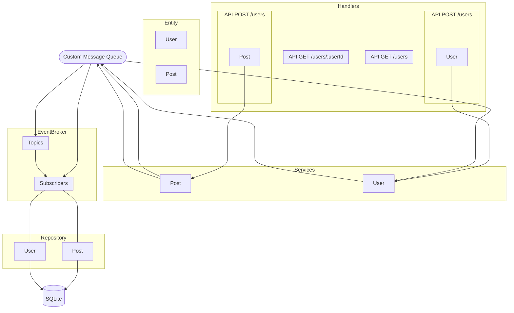
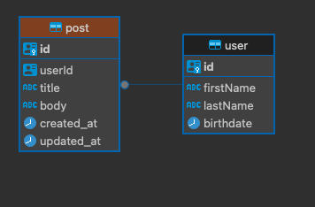

# Quick Summary
This repository focuses on creating a CRUD application for managing users and their associated posts using TypeORM, Serverless, and Zod for validation.




## Entity Relationship Diagram



## Running the Application
To run the application locally:

```bash
yarn install
yarn migrate:run
yarn seed
yarn start
```

## Testing

Integration tests are set up using Jest with an in-memory database. To run the tests:

```bash
yarn test
```

## Seeding the Database

To seed the database with initial data:

```bash
yarn seed
```

This command runs the seeding scripts that populate the database with initial data for development and testing purposes.


## Environment Setup

Before running the application, you'll need to set up your environment variables. Create a `.env` file in the root directory of the project with the following contents:

```env
NODE_ENV=production | development
POSTGRES_HOST=yourhostdetails
POSTGRES_PORT=5432
POSTGRES_USER=your_username
POSTGRES_PASSWORD=your_password
POSTGRES_DB=your_database
```

Replace **`your_username`**, **`your_password`**, and **`your_database`** with your PostgreSQL credentials. The application will use these settings to connect to your PostgreSQL instance.

- **`NODE_ENV`** - This determines the application mode. Use **`development`** for development settings, **`test`** for testing (however, I mocked the repository data for the tests created), and **`production`** for production settings (set up to use postgresDB).
- **`POSTGRES_HOST`** - The hostname where your PostgreSQL database is running.
- **`POSTGRES_PORT`** - The port number on which your PostgreSQL server is listening.
- **`POSTGRES_USER`** - Your PostgreSQL database username.
- **`POSTGRES_PASSWORD`** - Your PostgreSQL database password.
- **`POSTGRES_DB`** - The specific database name to connect to within your PostgreSQL instance.

For production environments, ensure that you set NODE_ENV=production to use PostgreSQL. The application will switch to SQLite for other NODE_ENV values.

## Implemented Solutions
The following sections detail the solutions implemented for the required tasks based on the application level.

### Main Tasks

- Changed the `User` entity to store a `birthdate` instead of `age`. The `age` getter calculates the age based on the `birthdate`.
- Added a GET endpoint at `/users` to retrieve all users in JSON format, including the calculated `age` field.
- Implemented a PATCH endpoint at `/users/:id` to update user details. Only `firstName`, `lastName`, and `birthdate` are editable.
- Created a DELETE endpoint at `/users/:id` to remove a user from the database.

### Intermediate Tasks

- Created a `Post` entity to represent user posts with all CRUD operations.
- Established a One-to-Many relationship between `Users` and `Posts`.
- Added a GET endpoint at `/users/:userId/posts` to fetch all posts by a specific user.
- Implemented pagination for the user listing endpoint, with query parameters for page size and number.
- Added a GET endpoint at `/posts/:postId` to fetch a specific post.
- Added a DELETE endpoint at `users/:userId/posts/:postId` to delete a post by its user. My assumption here is that we are not implementig an authorization middleware. So in that case, I could only fetch the `userId` from the `api` path
- Implemented a PATCH endpoint at `/users/:userId/posts/postId` to update a post by ts user. The `title`, and `body` are editable.
- Integrated Winston for structured JSON logging across the application.

### Senior Tasks

- Added a POST search endpoint at `/posts/` for querying posts by title.
- Created a mock "Event Service" to simulate event publishing to topics with `version` and `type` enforcement at runtime.

### Bonus Tasks

- Configured the data-source to switch between PostgreSQL and SQLite based on the `NODE_ENV`.
- Set up GitHub Actions to ensure passing tests and lint checks on every commit.
- Added seed scripts for initializing the database with test data.


## **Considerations**

- All code changes have been made with consideration to the existing serverless architecture.
- For deleting a post, I chose to use the path `/users/:id/post/:postId`. This is because my assumpton is that only a `user` can delete their posts and for this set up, I did not implement a middleware that handles authorization. Hence I get the `userId` from the api path.
- New features have been designed to be reusable, efficient, and performant.
- TypeORM migrations have been used exclusively for all database changes.
- RESTful principles have been followed for all API endpoints.
- Appropriate test cases have been created